# Barista Simulator — Architecture / Design Document

## Change History

| Version | Modifier | Date | Description |
|---|---|---|---|
| 0.1 | Erick | 2026-05-08 | Initial architecture write-up covering player, inventory, crafting, customer queue, and order/service subsystems. |

## 1. Introduction

This document describes the architecture and design of **Barista Simulator**, a first-person 3D coffee-shop simulation built in Unity 6 (6000.3.11f1) with the Universal Render Pipeline. The player runs a coffee shop: customers arrive in a queue, place orders at a kiosk, wait at a counter, and the player crafts drinks at coffee/toaster stations and delivers them to fulfill orders.

The core stakeholders are:

- The player (single role) — operates every station and runs the cafe.
- Course graders / reviewers — evaluating gameplay loop completeness and code organization.
- Future contributors — needing a clean structure to extend the game with new recipes, equipment, or NPC behaviors.

The system is described using five views, modeled on the 4+1 architectural view pattern:

- **Logical View** — main components, subsystems, and class relationships.
- **Process View** — runtime threads, coroutines, and event flow.
- **Development View** — folder layout and per-file ownership between contributors.
- **Physical View** — build target and deployment.
- **Use Case View** — supported player and NPC actions.

Two contributors authored the C# implementation: **Erick Vicencio** and **Alex Max**. Per-file primary ownership is given in the Development View (Section 6); the Member / Responsibility table maps subsystems to the lead contributor for that area.

## 2. Design Goals

The main design goals for Barista Simulator are:

- Keep the gameplay loop **legible end-to-end**: the player should see customer arrive → order appear → drink crafted → customer served, with clear feedback at each step.
- **Decouple subsystems** so player input, inventory, crafting, customer queueing, and order service can be developed and changed independently.
- **Single source of truth** for cross-system state (PlayerInventory, OrderManager) instead of scattered counters.
- **Event-driven communication** where possible (`PlayerInventory.OnChanged`, `FabricatorMenu.OnDrinkCrafted`, customer-state callbacks) so UI reflects state without polling.
- Prefer **ScriptableObjects** for data (recipes, ingredient definitions) and prefabs for visual content, so designers can author content without touching scripts.
- Reuse a **single fabricator UI** across all crafting stations (coffee machine, coffee remodel, toaster) — the station provides its recipe list and title; the menu builds itself dynamically.

The C# scripts are organized into seven subsystems:

- Player (movement, camera, interaction)
- Inventory (counts, hotbar, slot rendering)
- Recipes (data definitions)
- Crafting (stations + fabricator menu)
- Equipment (shelves, world props)
- Customers (queue, NPC actor, per-link movement)
- Orders (service loop, mat-trigger fulfillment)

Each lives in its own folder under `Assets/Scripts/`. Cross-subsystem communication goes through three mechanisms:
1. **Singletons** — `PlayerInventory.Instance` is the canonical inventory.
2. **Direct Inspector wiring** — references like `OrderManager.chain` or `CraftingStation.fabricatorMenu` are set on prefabs/scene instances.
3. **C# events / callbacks** — `PlayerInventory.OnChanged`, `Customer.orderManager.OnCustomerOrderPlaced(this)`, etc.

Customers and orders share state through the OrderManager state machine; orders are owned by the Customer instance carrying them, not by an integer ID, so the link customer ↔ order is implicit.

## 3. System Behavior

The high-level gameplay loop is shown below. The cafe starts closed; the player primes inventory at shelves, opens the cafe by stepping on the mat, then alternates between crafting at stations and delivering at the mat until the chain runs out.

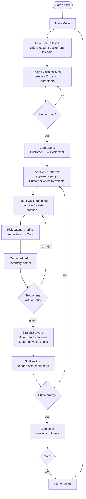

The player launches the build. The Menu scene loads first (cursor unlocked, mouse-driven menu). Pressing Play loads the Level scene.

In the Level scene the player spawns in a first-person controller with the cursor locked. Eight customer NPCs are visible in a queue line, frozen, near the kiosk. The order list panel in the top-right is empty.

The player walks to a shelf (Bread, Donut, Coffee Beans, etc.) and presses **E** — the shelf's `Interact()` adds 5 of its ingredient to the player inventory and the corresponding hotbar slot lights up with that ingredient's icon and count.

The player walks to the coffee machine and presses E. A Subnautica-style fabricator menu opens listing recipe categories (Hot, Cold, Food). The player drills into a category, picks a drink, optionally sets a sugar level (0–3), and clicks Craft. A progress bar runs for `craftTime` seconds, then the recipe's ingredients are consumed from inventory and the recipe's `output` ingredient is added (e.g., a `Latte_Out`). The drink also appears in the inventory hotbar.

The player walks onto the floor mat in front of the counter. **First mat step** flips the cafe state from `Closed` to `Open`. The chain head customer is detached from the queue and walks (or snaps, in Customer 0's case) to the kiosk wait point. After a 3-second dwell representing "placing an order," that customer's order appears in the top-right list with the recipe name and optional sugar level.

The customer then walks to one of four wait slots beside the counter. The chain shifts forward — the next chain head walks into the position just vacated, and once it reaches the kiosk wait point its own 3-second dwell starts. This continues until either the slot capacity (4) is reached or the chain runs out.

When the player crafts a drink that matches a waiting customer's order, they walk back onto the mat. `OrderManager.OnMatStepped()` scans the wait list in order, finds the first customer whose ordered recipe's output the player has stocked, and fires the fulfillment flow:

- If the match is **slot 0**, the customer receives the drink prefab on their left-hand bone via `Customer.GiveItem(recipe.itemPrefab)`, walks to the exit, and remaining waiters shift forward.
- If the match is **slot N > 0**, the head and matched customer swap visual positions concurrently, then the matched customer walks to exit, the head walks back to slot 0, and customers behind the matched slot shift forward to fill the gap.

The order row fades green and disappears, the player's served-customer count and money tally increment via `ProgressUI`, and the kiosk wait point becomes free — releasing the next chain head.

Pressing **Escape** opens the Pause menu (timescale 0, cursor unlocked). Returning to menu loads scene 0.

## 4. Logical View

### 4.1 High-Level Design

Barista Simulator is a single-process Unity desktop application with no backend service. Three logical tiers describe the runtime:

```
┌──────────────────────────────────────────────────────────┐
│ Unity Runtime (single process)                           │
│  ┌────────────┐ ┌────────────┐ ┌────────────┐           │
│  │  Scenes    │ │  Scripts   │ │  Assets    │           │
│  │ (Menu,     │ │ (~21 .cs   │ │ (Recipes,  │           │
│  │  Level,    │ │  files in  │ │  Ingredients│          │
│  │  Queue,    │ │  7 subsys) │ │  Prefabs)  │           │
│  │  Credits)  │ │            │ │            │           │
│  └────────────┘ └────────────┘ └────────────┘           │
└──────────────────────────────────────────────────────────┘
                          │
                          │  Player input, render
                          ▼
                    ┌──────────────┐
                    │   Player     │
                    │   (mouse +   │
                    │    keyboard) │
                    └──────────────┘
```

The application has no network calls, no backend, no save game (yet), and no external services. State persists only for the lifetime of the Play session.

### 4.2 Mid-Level Design

The Level scene's runtime is divided into seven cooperating subsystems. They communicate through three patterns: a `PlayerInventory` singleton, Inspector-wired references, and C# events.

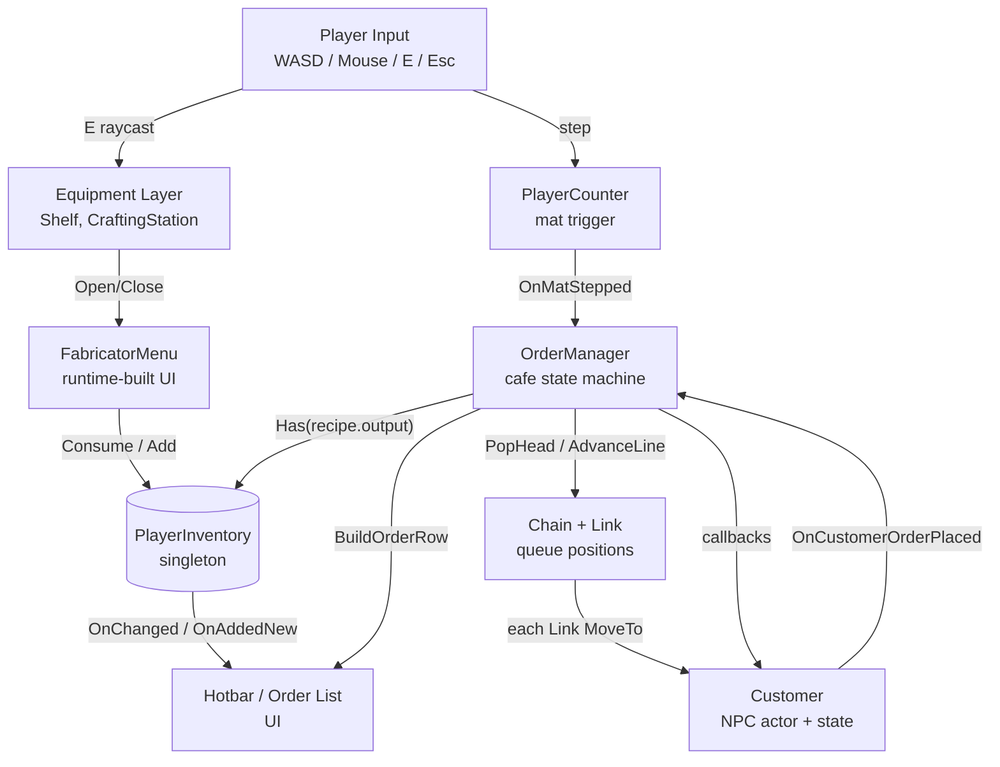

`PlayerInventory.Instance` is read by every subsystem that touches inventory; its `OnChanged` and `OnAddedNew` events drive both the hotbar UI and reactive UI elements like the fabricator's ingredient checklist.

#### Main system flows

**Crafting flow** — Player presses E on a CraftingStation → station calls `FabricatorMenu.Open(recipes, title)` → menu renders categories/drinks → player selects + clicks Craft → coroutine waits `craftTime` seconds with a progress bar → `PlayerInventory.Consume(ingredients)` and `PlayerInventory.Add(output, 1)` → menu refreshes ingredient checklist.

**Customer arrival flow** — Player steps on mat (first time) → `PlayerCounter.OnTriggerEnter` → `OrderManager.OnMatStepped()` → `OpenCafe()` → `Chain.PopHead()` returns the head Customer + saves the spot → `Customer.GoToKioskAndOrder(KioskWaitPoint)` runs the walk + 3 s dwell coroutine → `OrderManager.OnCustomerOrderPlaced(this)` → order row built in top-right UI → `TryReleaseKioskOccupant()` walks the customer to a wait slot, fires `Chain.AdvanceLine()`, and releases the next chain head.

**Order fulfillment flow** — Player crafts a drink → output added to inventory → player steps on mat → `OrderManager.OnMatStepped()` (cafe is Open) → `_waiters.FindIndex(c => Has(c.Order.recipe.output, 1))` → if match at slot 0, `StraightServe` coroutine; else `SwapServe` coroutine with concurrent visual swap → `PlayerInventory.Consume` the output → `Customer.GiveItem(itemPrefab)` spawns the drink at the customer's left-hand bone → `Customer.GoToExit` → `ProgressUI.ServeCustomer(price)` increments tally → remaining waiters shift forward.

### 4.3 Detailed Class Design

#### Player subsystem

```
PlayerMovement       ─── reads Input System "Movement" / "Jump" / "Sprint"
                         CharacterController-driven; camera-relative motion.

CameraLook           ─── reads Mouse delta; clamps pitch, rotates body Y.

PlayerInteract       ─── on E, raycasts from camera; calls IInteractable.Interact()
                         on the first hit.

PauseMenu            ─── on Escape, toggles Time.timeScale and shows pause UI.
```

`IInteractable` is the small interface the player uses to talk to world objects. Both `Shelf` and `CraftingStation` implement it, so a single raycast handles all "press E" interactions uniformly.

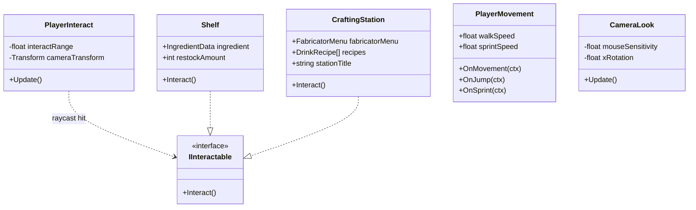

#### Inventory subsystem

```
PlayerInventory  (singleton)
    Instance              : static
    _counts               : Dictionary<IngredientData, int>
    OnChanged             : event Action
    OnAddedNew            : event Action<IngredientData>
    Add(ing, qty)         : adds; fires OnAddedNew on 0→positive
    Consume(ingredients)  : atomic (returns false if any missing)
    Has(ing, qty)         : bool
    Get(ing)              : int

HotbarManager
    slots[]               : IngredientSlot
    AssignSlot(ing)       : on PlayerInventory.OnAddedNew, binds a free slot.

IngredientSlot           ─── one per hotbar cell.
    ingredient            : IngredientData (assigned by HotbarManager)
    Refresh()             : updates icon, count badge, disambiguation badge ("CO" etc.)
    PopRoutine()          : count-up pop animation.

InventorySelector        ─── handles 1–9/0 keys + scroll wheel selecting a slot.

IngredientData (SO)      ─── ingredientName + Sprite icon.
```

The hotbar is **dynamic** — slots are not pre-assigned to ingredients in the Inspector. The first time the player picks up Bread, the next empty `IngredientSlot` becomes the Bread slot. Sticky bindings: a slot keeps its ingredient even when the count drops to 0.

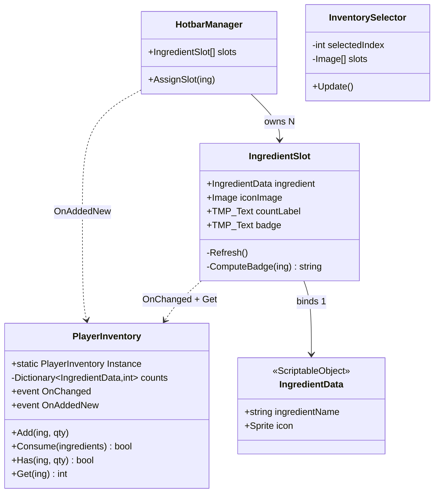

#### Recipes / Crafting subsystem

```
DrinkRecipe (SO)
    drinkName, category (Hot/Cold/Food)
    ingredients[]        : RecipeIngredient[]
    craftTime, price
    output               : IngredientData     // what hits inventory
    itemPrefab           : GameObject         // 3D model spawned on customer hand
    description          : string

CraftingStation : IInteractable
    fabricatorMenu, recipes[], stationTitle
    Interact()           : opens the menu with this station's recipes.

FabricatorMenu
    Open(recipes, title), Close()
    OnDrinkCrafted       : event Action<DrinkRecipe, int sweetness>
    BuildUI()            : runtime-built Subnautica-style menu (panel,
                           categories, ingredient checklist with green/red
                           status, sugar selector, craft button + progress
                           bar).
    CraftDrink(drink)    : coroutine; consumes ingredients, adds output.
```

A single `FabricatorMenu` instance lives on the Canvas and is reused by every crafting station. Stations differ only by the `recipes[]` array and `stationTitle` they pass to `Open`. The Cortado recipe was recently fixed to require Milk in addition to Espresso (matches its description). The CoffeeMachineRemodel station now has the same eight recipes as the original CoffeeMachine.

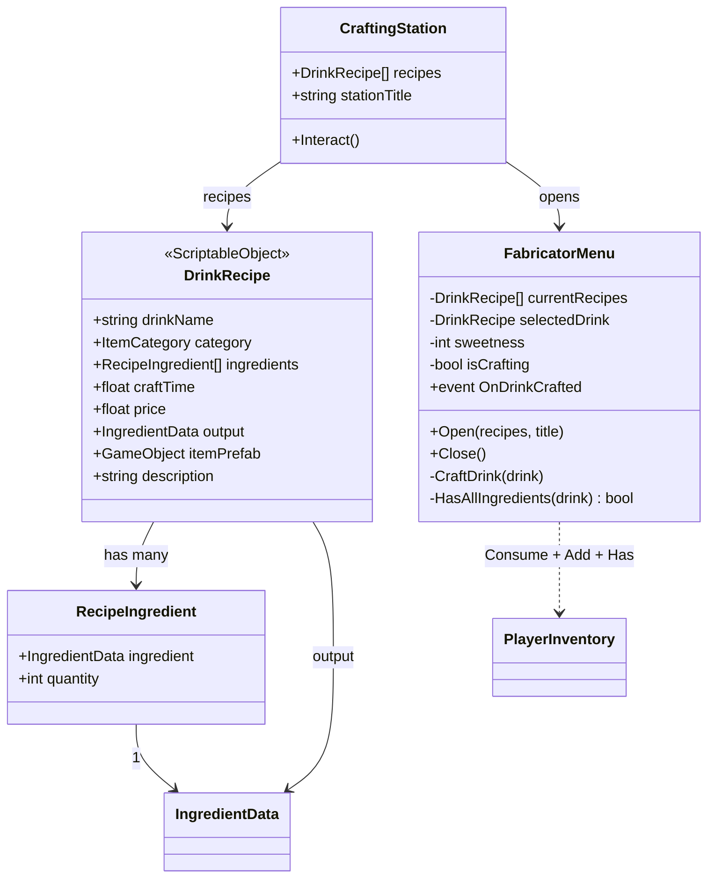

#### Equipment subsystem

```
Shelf : IInteractable
    ingredient, restockAmount (default 5), item, itemPoint
    Start()              : spawns the visual model with ItemHover for spin.
    Interact()           : adds restockAmount of `ingredient` to inventory.

ItemHover
    rotationSpeed
    Update()             : continuously rotates the held visual; gives
                           shelved items a "Sims pickup-style" floating spin.
```

Shelves are passive ingredient sources — there is no scarcity or restock cooldown. This keeps the gameplay tight on the ordering/fulfillment loop rather than resource management.

#### Customer queue subsystem

```
Chain
    links[]              : Link[]    // 8 prefab queue positions
    counterTransform, exitPointTransform
    remaining            : int
    PopHead()            : detaches the head Customer GameObject from the
                           queue; saves its world transform for the next-up
                           link to step into.
    AdvanceLine()        : called when the popped customer leaves the kiosk
                           wait point — shifts each remaining link to the
                           next position via MoveToNext.

Link  (one per chain position; component lives on the Customer GameObject)
    customer             : GameObject  (the Customer this Link manages)
    nextPosition, nextRotation
    MoveToPoint(...)     : coroutine that lerps transform + animator can_walk.
    MoveToNext()         : start a lerp toward this link's nextPosition.

Customer (NPC actor)
    State                : enum { Idle, WalkingToKiosk, AtKiosk,
                                  KioskFinished, WalkingToSlot,
                                  WaitingAtCounter, WalkingToExit }
    Order, orderManager
    walkTo*Seconds, kioskDwellSeconds
    GoToKioskAndOrder(t) : walks to the kiosk wait point, dwells, then
                           signals OrderManager.OnCustomerOrderPlaced.
    GoToSlot(t)          : walks to a wait-slot transform.
    GoToExit(t)          : walks to the exit and disables the GameObject.
    GiveItem(prefab)     : spawns the recipe's itemPrefab at the
                           itemSpawnTransform (left-hand bone).
```

The chain is structurally Alex's design — a linked-list-style snake queue where each `Link` is a position the next customer walks into. The `PopHead`/`AdvanceLine` split, the per-customer state machine, and the snap-if-already-there guard in `WalkTo` are Erick's additions, made when the gameplay loop was being wired (May 2026).

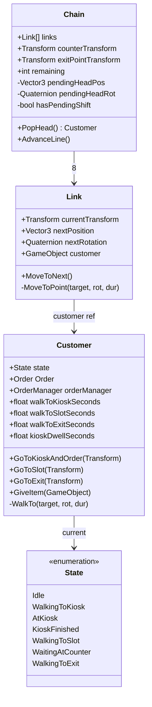

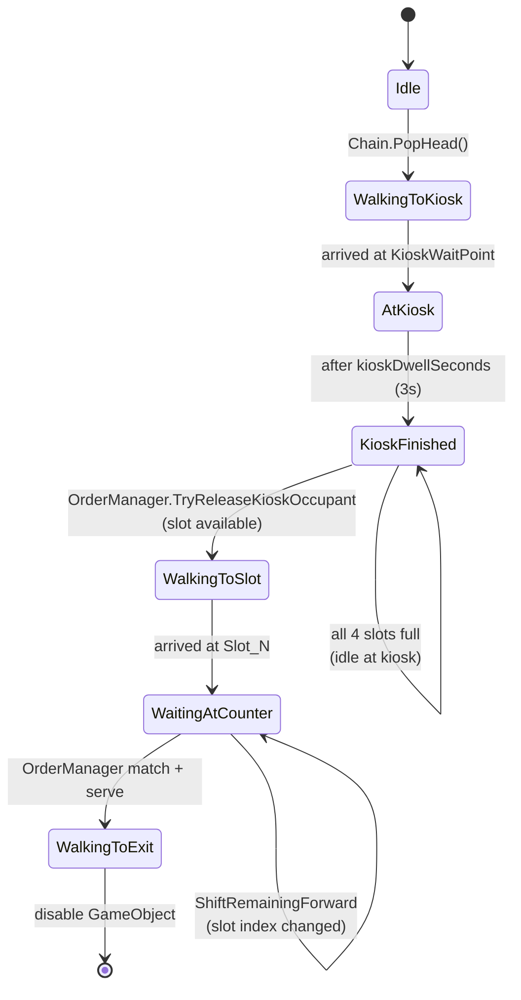

#### Order / Service Loop subsystem

```
Order  (data bag carried by Customer)
    recipe   : DrinkRecipe
    sweetness: int  // 0–3 if the recipe is a drink, 0 for food

OrderManager
    cafeState            : { Closed, Open }
    waiters              : List<Customer>  // index = visual slot
    kioskOccupant        : Customer
    chain, kioskTransform, slotTransforms[4]
    OnMatStepped()       : entry point from PlayerCounter.
    OnCustomerOrderPlaced(c) : called by Customer when its dwell ends.
    OpenCafe(), TryReleaseKioskOccupant(), TryReleaseChainHead()
    StraightServe(n)     : coroutine; serves a slot-0 match.
    SwapServe(n)         : coroutine; head ↔ matched swap, then serve.
    BuildOrderRow / FadeOrderRow : top-right UI.

PlayerCounter (mat trigger)
    orderManager
    OnTriggerEnter(col)  : if Player tag, calls orderManager.OnMatStepped().

ProgressUI
    customerCountText, moneyText, totalCustomers
    ServeCustomer(price) : increments served count + money.
```

OrderManager is the central authority over the cafe loop. It owns the wait-slot list and the kiosk occupant, drives chain releases, and is the single place that knows whether the cafe is open. Customers signal it via callbacks; PlayerCounter delegates mat events to it. The `_serveInFlight` guard prevents mat-spam from stacking multiple coroutines.

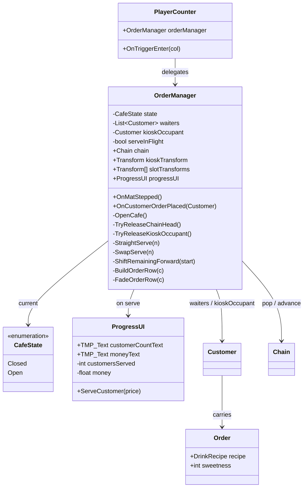

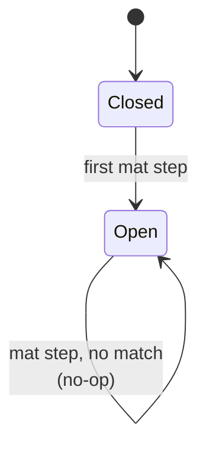

#### Design Notes

- The `Order` data class lives next to OrderManager but is carried on the `Customer`. There is no integer order ID; the customer instance is the order key.
- The mat is the single physical contact point between the player and the cafe state. First step opens the cafe; subsequent steps attempt fulfillment. Empty inventory and non-matching items are silent no-ops.
- Customer 0 (the chain's authored head) sits exactly at the `KioskWaitPoint` transform. Their walk-to-kiosk is therefore a 0-distance, 0-rotation walk, which the `Customer.WalkTo` coroutine handles by snapping and yielding immediately rather than animating in place.
- Skip-with-swap on non-head fulfillment is animated as: head and matched walk to each other's slots, matched walks to exit, head returns to slot 0, customers behind the gap shift forward.

## 5. Process View

Barista Simulator runs as a single Unity process. Every system is single-threaded against the Unity main thread; concurrency is achieved through MonoBehaviour coroutines (`StartCoroutine` / `IEnumerator`) and event callbacks rather than threads.

```
┌─────────────────────────────────────────────────────────────┐
│ Unity Main Thread                                           │
│                                                             │
│  Update loop:                                               │
│    PlayerMovement.Update()    ─── camera-relative motion    │
│    CameraLook.Update()        ─── mouse-look                │
│    PlayerInteract.Update()    ─── E-press raycast           │
│    PauseMenu.Update()         ─── Esc handling              │
│    InventorySelector.Update() ─── slot key/scroll           │
│    ItemHover.Update()         ─── shelf-item spin           │
│                                                             │
│  Trigger callbacks:                                         │
│    PlayerCounter.OnTriggerEnter ──▶ OrderManager.OnMat...   │
│                                                             │
│  Coroutines (live on a MonoBehaviour, run in step           │
│   with the frame; yield to next frame or WaitForSeconds):   │
│    FabricatorMenu.CraftDrink()                              │
│    Customer.GoToKioskRoutine() / GoToSlot... / GoToExit...  │
│    Chain Link.MoveToPoint()                                 │
│    OrderManager.StraightServe / SwapServe / FadeRow         │
│                                                             │
│  Animator: parameter writes (`can_walk`) are read by        │
│  Unity's animation system, which runs its own internal      │
│  scheduling but exposes only main-thread API.               │
└─────────────────────────────────────────────────────────────┘
```

There is no multi-threaded code in the project. The design intentionally keeps everything on the main thread; coroutines provide the interleaving for "wait N seconds, then continue."

## 6. Development View

The C# code under `Assets/Scripts/` is organized into four folders matching the seven logical subsystems:

```
Assets/Scripts/
├── Character/         (customer queue subsystem)
│   ├── Chain.cs
│   ├── Customer.cs
│   └── Link.cs
├── Equipment/         (world props)
│   ├── FabricatorMenu.cs
│   ├── ItemHover.cs
│   └── Shelf.cs
├── Inventory/         (inventory + recipes + crafting + service-UI)
│   ├── CraftingStation.cs
│   ├── DrinkRecipe.cs
│   ├── HotbarManager.cs
│   ├── IngredientData.cs
│   ├── IngredientSlot.cs
│   ├── InventorySelector.cs
│   ├── Menu.cs
│   ├── OrderManager.cs
│   └── ProgressUI.cs
└── Player/            (input + camera + interaction)
    ├── CameraLook.cs
    ├── PauseMenu.cs
    ├── PlayerCounter.cs
    ├── PlayerInteract.cs
    ├── PlayerInventory.cs
    └── PlayerMovement.cs
```

(Note: `OrderManager.cs` and the order-related UI live in the `Inventory/` folder for historical reasons — order rows are built into the same Canvas as the inventory hotbar. A future refactor could move them under a dedicated `Service/` folder without changing behavior.)

### Per-file primary ownership

Primary owner is the contributor whose authorship appears on the majority of current lines (`git blame`). "Mixed (X / then Y)" means file was created by X and then substantially rewritten by Y.

| File | Primary Owner | Notes |
|---|---|---|
| `Character/Chain.cs` | **Mixed (Alex / then Erick)** | Snake-style queue. PopHead/AdvanceLine split is Erick's. |
| `Character/Customer.cs` | **Mixed (Alex / then Erick)** | NPC actor. State machine + walk coroutines + GiveItem are Erick's. |
| `Character/Link.cs` | Alex | Per-position lerp; `customer.GetComponent<Animator>()` pattern. |
| `Equipment/FabricatorMenu.cs` | **Erick** | ~600-line runtime-built Subnautica-style menu. |
| `Equipment/ItemHover.cs` | Alex | Shelf-item rotation. |
| `Equipment/Shelf.cs` | **Erick** | `IInteractable` + ingredient give-on-press. |
| `Inventory/CraftingStation.cs` | **Erick** | `IInteractable` adapter into FabricatorMenu. |
| `Inventory/DrinkRecipe.cs` | **Erick** | `[CreateAssetMenu]` Drink Recipe ScriptableObject. |
| `Inventory/HotbarManager.cs` | **Erick** | Dynamic slot binding on first ingredient acquisition. |
| `Inventory/IngredientData.cs` | **Erick** | Ingredient ScriptableObject. |
| `Inventory/IngredientSlot.cs` | **Erick** | Hotbar cell rendering + pop animation + initials badge. |
| `Inventory/InventorySelector.cs` | Alex | 1–9/0 keys + scroll-wheel selection. |
| `Inventory/Menu.cs` | Alex | Main menu scene-load + quit. |
| `Inventory/OrderManager.cs` | **Erick** | Cafe state machine, wait-list, swap-serve. |
| `Inventory/ProgressUI.cs` | Alex | Served-count + money tally. |
| `Player/CameraLook.cs` | Alex | First-person mouse-look. |
| `Player/PauseMenu.cs` | Alex | Esc-to-pause. |
| `Player/PlayerCounter.cs` | **Mixed (Alex / then Erick)** | Mat trigger; rewrote to delegate to OrderManager. |
| `Player/PlayerInteract.cs` | Alex | Camera raycast + IInteractable. |
| `Player/PlayerInventory.cs` | **Erick** | Counts + atomic Consume + change events. |
| `Player/PlayerMovement.cs` | Alex | CharacterController + Input System. |

### Subsystem ownership summary

| Subsystem | Lead Contributor | Notes |
|---|---|---|
| Player input / camera / interact / pause | Alex | Includes `PlayerInteract` raycast pattern and `IInteractable` interface. |
| Inventory (counts, hotbar, slot rendering) | **Erick** | `PlayerInventory.Instance`, `HotbarManager` dynamic binding, `IngredientSlot` rendering. Slot-selection UX (`InventorySelector`) is Alex's. |
| Recipes / Crafting (FabricatorMenu, CraftingStation, DrinkRecipe) | **Erick** | Includes the runtime-built fabricator UI. |
| Equipment (Shelf, ItemHover) | Mixed | Shelf logic Erick; ItemHover Alex. |
| Customer queue (Chain, Customer, Link) | Mixed | Initial chain + Link by Alex; state-machine rewrite + PopHead/AdvanceLine split by Erick. |
| Order / Service Loop (OrderManager, PlayerCounter mat) | **Erick** | Cafe state machine, wait-slot list, swap-serve coroutine. |
| UI / scene flow (Menu, PauseMenu, ProgressUI) | Alex | Plus runtime UI building scattered through Erick's `FabricatorMenu` and `OrderManager.BuildOrderRow`. |

## 7. Physical View

```
              ┌─────────────────────────┐
              │  Developer machine      │
              │  Unity 6 Editor         │
              │  C# / .NET / IL2CPP     │
              └─────────┬───────────────┘
                        │  Build (Standalone)
                        ▼
              ┌─────────────────────────┐
              │  Game executable        │
              │  (Windows/macOS Player) │
              │   - assets bundled      │
              │   - no network calls    │
              │   - no save persistence │
              └─────────────────────────┘
```

Barista Simulator targets a standalone Unity build (Windows or macOS Player). The Editor + IDE are configured at `/Users/erick/barista-simulator`. There is no backend service, no database, no authentication, and no network usage; the game runs entirely on the local machine.

Source control is GitHub (`demiurge94/barista-simulator`). Git LFS is enabled for binary assets (textures, FBX, prefab thumbnails). The default branch is `main`; feature work happens on short-lived `feat/*` and `fix/*` branches that squash-merge back into main.

## 8. Use Case View

The system has one player actor and a set of NPC actors (customers) that operate autonomously once the cafe is opened.

### Player use cases

- Look (mouse), walk (WASD), sprint (Shift), jump (Space)
- Interact (E) with shelves to pick up ingredients
- Interact (E) with crafting stations to open the fabricator
- Browse fabricator categories, pick a drink, set sugar level (0–3)
- Craft a drink (consumes ingredients, adds output to inventory)
- Step on the floor mat to open the cafe (first time) or deliver an order (subsequent times)
- Pause / resume the game (Escape)
- Return to main menu / quit from pause

### NPC (Customer) behaviors

- Spawn in the chain (authored at scene load — 8 customers)
- Walk from chain spot to kiosk wait point when popped
- Dwell at the kiosk for `kioskDwellSeconds` (currently 3 s) to "place an order"
- Walk to an open wait slot, or idle at the kiosk if all slots are full
- Receive a drink visual on left-hand bone when their order is fulfilled
- Walk to the exit and despawn after fulfillment

### Important Scenarios

#### Open the cafe

```
OpenCafe()
  1. Player walks onto the floor mat for the first time.
  2. PlayerCounter.OnTriggerEnter detects the Player tag.
  3. OrderManager.OnMatStepped sees cafeState == Closed → OpenCafe().
  4. Chain.PopHead returns the head Customer + records the spot.
  5. Customer.GoToKioskAndOrder runs (Customer 0: snap-and-skip walk;
     others: 4-second walk to KioskWaitPoint).
  6. After 3-second dwell, OnCustomerOrderPlaced builds the order row.
  7. TryReleaseKioskOccupant walks the customer to slot 0,
     calls Chain.AdvanceLine, releases the next chain head.
```

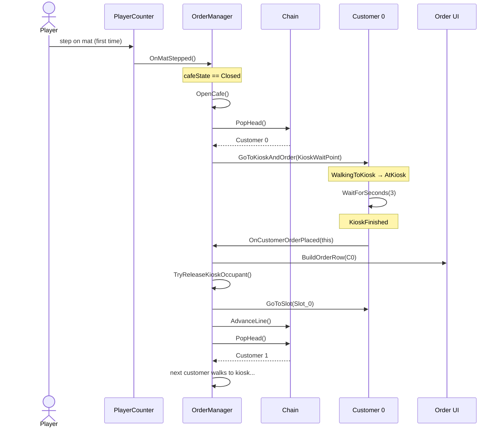

#### Craft a drink

```
Craft(recipe, sweetness)
  1. Player presses E on a CraftingStation.
  2. CraftingStation.Interact opens FabricatorMenu with its recipes.
  3. Player picks a category, then a drink, optionally sets sugar.
  4. FabricatorMenu.OnCraftPressed → CraftDrink coroutine:
     a. Run progress bar for craftTime seconds.
     b. PlayerInventory.Consume(recipe.ingredients).
     c. PlayerInventory.Consume(sugar × sweetness).
     d. PlayerInventory.Add(recipe.output, 1).
  5. Menu refreshes ingredient checklist + craft button state.
```

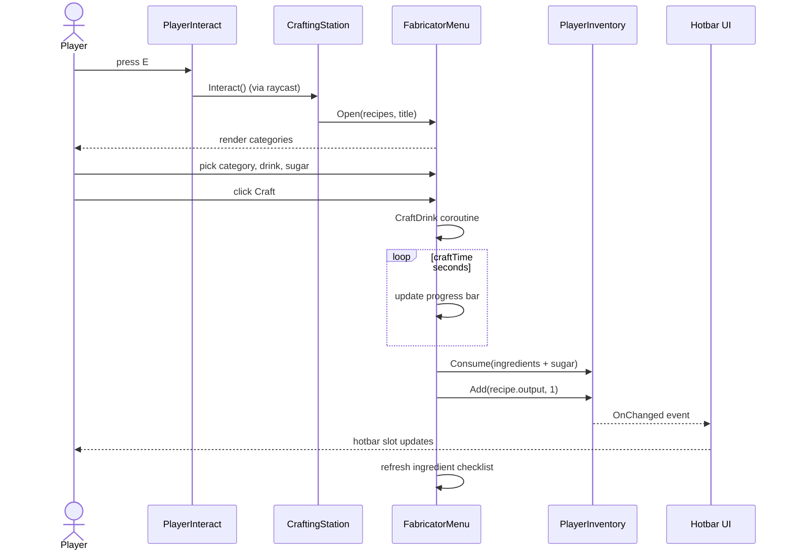

#### Deliver a drink

```
Deliver()
  1. Player crafts the drink a waiting customer ordered.
  2. Player walks onto the mat. PlayerCounter calls OnMatStepped.
  3. OrderManager (cafeState == Open, _serveInFlight == false):
     a. FindIndex on _waiters for first whose recipe.output the
        player has at least 1 of in PlayerInventory.
     b. Consume 1 of that output.
  4. If matched at slot 0: StraightServe coroutine.
     If matched at slot N > 0: SwapServe coroutine
       (head ↔ matched swap, matched leaves, head returns).
  5. Customer.GiveItem(recipe.itemPrefab) spawns the drink on the
     customer's left hand bone.
  6. Customer.GoToExit walks them off and disables.
  7. ShiftRemainingForward closes the gap in the wait list.
  8. ProgressUI.ServeCustomer(recipe.price) increments tally.
  9. TryReleaseKioskOccupant frees the kiosk → next customer
     walks up; AdvanceLine shifts the chain.
```

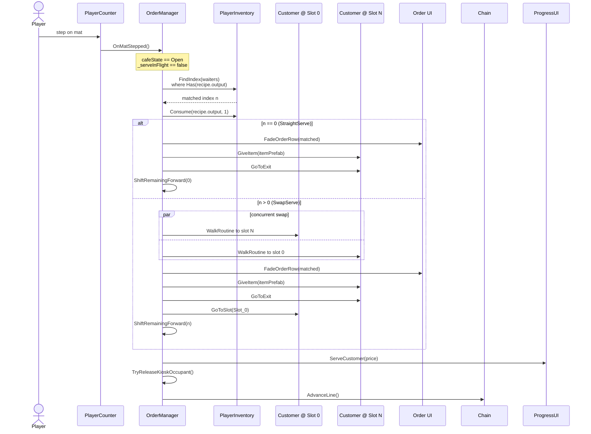

## References

- Unity Engine documentation — https://docs.unity3d.com/
- Unity ScriptableObject pattern (CreateAssetMenu) — https://docs.unity3d.com/ScriptReference/CreateAssetMenuAttribute.html
- Subnautica Fabricator UI (visual inspiration for the crafting menu)
- Project repository — `demiurge94/barista-simulator` on GitHub
- Customer Character from Kenney.nl - https://kenney.nl/assets/animated-characters-retro
- Game Music from opengameart.org by Cleyton Kauffman - https://opengameart.org/content/shop-theme
